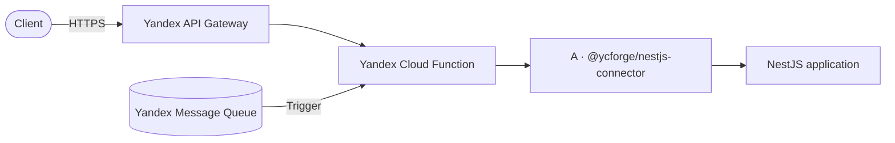
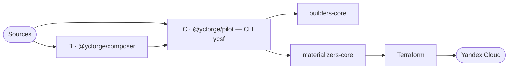

<div align="center">

# serverless-tools

**Write plain NestJS — deploy to Yandex Cloud Serverless.**

A runtime adapter, API Gateway composition builder, and build/deploy orchestrator
that never turn NestJS into a separate framework and never make you hand-write
infrastructure.

[Русский](README.md) · [**English**](README.en.md)

[](https://github.com/ycforge/serverless-tools/actions/workflows/ci.yml)
[](LICENSE)
[](https://www.npmjs.com/package/@ycforge/pilot)
[](https://www.npmjs.com/package/@ycforge/nestjs-connector)
[](https://nodejs.org)
[](https://pnpm.io)

</div>

---

## What it is

`serverless-tools` is a toolchain for running ordinary applications (NestJS
first) on Yandex Cloud Serverless. Your application stays a regular NestJS app
with all the usual building blocks — DI, guards, pipes, interceptors, exception
filters, middleware. Infrastructure is declared in `.ycsf/*.yaml` and generated
into Terraform.

Four responsibilities are strictly separated:

> **A owns runtime, B owns API composition, C owns orchestration/build, Terraform owns provisioning/deployment.**

## Features

- **Unmodified NestJS.** HTTP controllers, guards, pipes, interceptors,
  exception filters, and DI behave exactly as in a regular app.
- **Two transports.** HTTP through Yandex API Gateway (payload format 2.0 and
  `cloud_functions` v1) and Message Queue trigger — with a normalized execution
  context and `trace_id`.
- **One API Gateway.** Multiple applications are composed into a single
  OpenAPI/API Gateway specification with fail-fast conflict detection.
- **Declarative deployment.** `.ycsf/*.yaml` → build → Terraform generation →
  `terraform plan/apply`.
- **Plugin architecture.** Builders (application build) and materializers
  (Terraform generation) are replaceable, versioned plugins.
- **Incremental builds.** Content-addressed artifact cache.
- **Local development.** A dev server emulates API Gateway invocations without
  the cloud.

## Architecture

**Runtime (Project A):** a request flows through API Gateway and a Cloud Function
into the runtime adapter, while the application stays NestJS.



**Build & deploy (Project B + C):** composer builds the API specification, pilot
orchestrates builders and materializers, and hands the result to Terraform.



| Project | Role | Responsibility |
|---------|------|----------------|
| **A** | Runtime | Runs NestJS inside a Cloud Function, adapts HTTP/MQ invocations |
| **B** | API composition | Composes OpenAPI and the API Gateway specification from multiple apps |
| **C** | Orchestration / build | Runs builds, collects artifacts, generates Terraform |
| **Terraform** | Provisioning / deployment | Creates and changes resources in Yandex Cloud |

## Packages

| Package | Role | Purpose |
|---------|------|---------|
| [`@ycforge/nestjs-connector`](https://www.npmjs.com/package/@ycforge/nestjs-connector) | A · runtime | NestJS ↔ Yandex Cloud Functions runtime/transport adapter (HTTP + Message Queue) |
| [`@ycforge/composer`](https://www.npmjs.com/package/@ycforge/composer) | B · composition | OpenAPI extraction and single API Gateway specification composition; CLI `ycsf-api` |
| [`@ycforge/pilot`](https://www.npmjs.com/package/@ycforge/pilot) | C · orchestrator | Build/deploy orchestrator; CLI `ycsf`; plugin contracts `@ycforge/pilot/contracts` |
| [`@ycforge/builders-core`](https://www.npmjs.com/package/@ycforge/builders-core) | Build plugins | Builders: `nestjs-function`, `docker`, `vite` |
| [`@ycforge/materializers-core`](https://www.npmjs.com/package/@ycforge/materializers-core) | Terraform plugins | Materializers: `yandex-function`, `yandex-serverless-container`, `yandex-api-gateway`, `yandex-message-queue`, `yandex-storage-bucket` |
| [`@ycforge/serverless-dev-tools`](https://www.npmjs.com/package/@ycforge/serverless-dev-tools) | Local development | Dev server with API Gateway v2 emulation |

## Requirements

- **Node.js ≥ 22**
- **Terraform ≥ 1.5** — for `ycsf plan` / `apply` / `destroy`
- **Docker** — only for building serverless containers (the `docker` builder)
- **Yandex Cloud credentials** — only to talk to the cloud:
  `YC_SERVICE_ACCOUNT_KEY_FILE` and `YC_FOLDER_ID`

## Installation

```bash
# Runtime adapter (application dependency)
npm install @ycforge/nestjs-connector

# Build & deploy toolchain
npm install -D @ycforge/pilot @ycforge/composer @ycforge/builders-core @ycforge/materializers-core

# Optional: local dev server
npm install -D @ycforge/serverless-dev-tools
```

## Quick start

A minimal serverless application: one HTTP endpoint bundled into a Cloud Function.

### 1. Project layout

```text
my-service/
├── .ycsf/
│   ├── apps.yaml          # which applications the project has
│   └── builders.yaml      # which plugins to use
├── app/
│   ├── build_config.yaml  # how to build the application
│   └── src/
│       ├── app.module.ts
│       └── main.ts
├── package.json
└── tsconfig.json
```

### 2. Application

```ts
// app/src/app.module.ts
import { Controller, Get, Module } from '@nestjs/common';

@Controller()
class AppController {
  @Get('/ping')
  ping() {
    return { status: 'ok' };
  }
}

@Module({ controllers: [AppController] })
export class AppModule {}
```

```ts
// app/src/main.ts
import 'reflect-metadata';
import { createYandexHandler } from '@ycforge/nestjs-connector';
import { AppModule } from './app.module';

export const handler = createYandexHandler(AppModule);
```

### 3. Project configuration

```yaml
# .ycsf/apps.yaml
version: 1
apps:
  my_service:
    source_path: app
    builder: ycforge:function
    depends_on: []
```

```yaml
# .ycsf/builders.yaml
version: 1
builders:
  ycforge:function: "@ycforge/builders-core/nestjs-function"
materializers:
  yandex-function: "@ycforge/materializers-core/yandex-function"
```

```yaml
# app/build_config.yaml
version: 1
build_config:
  entry: src/main.ts
  runtime: nodejs22
build_env: {}
```

### 4. Build and deploy

```bash
npx ycsf check        # validate project contracts
npx ycsf build        # build the app → artifacts
npx ycsf materialize  # generate infra/*.tf.json
npx ycsf plan         # build + materialize + terraform plan
```

Creating cloud resources requires credentials (`YC_SERVICE_ACCOUNT_KEY_FILE`,
`YC_FOLDER_ID`):

```bash
npx ycsf apply        # full pipeline + terraform apply
npx ycsf destroy      # tear down infrastructure
```

> Generated Terraform configuration lives in `infra/`; you can run
> `terraform plan` and `terraform apply` there manually.

## CLI

**`ycsf`** — build/deploy orchestrator (`@ycforge/pilot`):

| Command | Purpose |
|---------|---------|
| `ycsf check` | Validate project contracts (`.ycsf/*`, references, resources) without Terraform |
| `ycsf build` | Build applications through builders |
| `ycsf materialize` | Generate `infra/*.tf.json` through materializers |
| `ycsf plan` | `build` + `materialize` + `terraform plan` |
| `ycsf apply` | Full pipeline + `terraform apply` |
| `ycsf destroy` | `terraform destroy` |

Useful flags: `-p, --project-dir <path>`, `--target <app>`, `--no-cache`,
`--json`, `--no-color`.

**`ycsf-api`** — API Gateway composition (`@ycforge/composer`):

| Command | Purpose |
|---------|---------|
| `ycsf-api compile` | Compose the single API Gateway specification |
| `ycsf-api check` | Validate the composition configuration |

## Example project

A full end-to-end example lives in
[`examples/reference-project`](examples/reference-project): four applications
(`user_service`, `analytics`, `frontend`, `openapi`) going from NestJS sources
to a validated `terraform plan`.

```bash
pnpm install
pnpm -r build
pnpm --filter @ycforge/reference-project plan
```

## Local development

`@ycforge/serverless-dev-tools/server` runs the application locally, emulating API
Gateway v2 invocations (fail-open without an IAM token):

```ts
import { createYcsfLocalServer } from '@ycforge/serverless-dev-tools/server';

const server = await createYcsfLocalServer({
  entry: './app/src/app.module.ts',
  port: 3000,
});

console.log(`Local: ${server.baseUrl}`);
```

Running TypeScript requires a loader (`tsx`), e.g.
`node --import tsx/esm dev.ts`.

## Documentation

- [`IDEA.md`](IDEA.md) — ecosystem architecture: contracts, `.ycsf` formats,
  plugin API, and invariants.
- [`packages/nest-bridge/README.md`](packages/nest-bridge/README.md) — runtime
  adapter capabilities.
- [`packages/pilot/README.md`](packages/pilot/README.md) — orchestrator and plugin
  contracts.
- [`packages/builders-core/README.md`](packages/builders-core/README.md) — builders.

## Contributing

The development process, branch/PR requirements, and how to run tests and linters
are described in [`CONTRIBUTING.md`](CONTRIBUTING.md) (in Russian).

## License

[MIT](LICENSE) © ycforge
