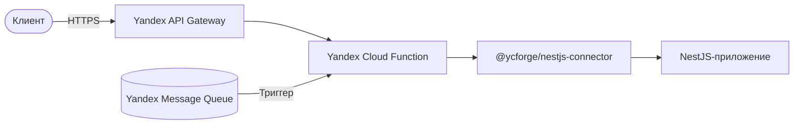
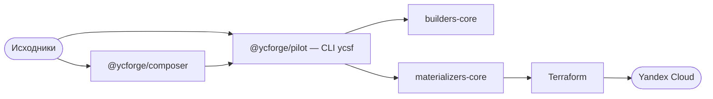

<div align="center">

# serverless-tools

**Пишите обычное приложение — разворачивайте в Yandex Cloud Serverless.**

Runtime-адаптер для NestJS, композиция API Gateway и оркестратор сборки и
деплоя.

[**Русский**](README.md) · [English](README.en.md)

[](https://github.com/ycforge/serverless-tools/actions/workflows/ci.yml)
[](LICENSE)
[](https://www.npmjs.com/package/@ycforge/pilot)
[](https://www.npmjs.com/package/@ycforge/nestjs-connector)
[](https://nodejs.org)
[](https://pnpm.io)

</div>

---

## Что это

`serverless-tools` — инструменты для запуска обычных приложений в Yandex Cloud
Serverless. Ваше приложение продолжает работать как обычно. Например, в NestJS
остаются на месте DI, guards, pipes, interceptors, exception filters и
middleware. Инфраструктура описывается декларативно в `.ycsf/*.yaml` и
генерируется в Terraform.

Слои не смешиваются: выполнение кода, композиция API, оркестрация сборки и
провижининг ресурсов отвечают каждый за своё.

## Возможности

- **NestJS без изменений.** HTTP-контроллеры, guards, pipes, interceptors,
  exception filters и DI работают как в обычном приложении.
- **Два транспорта.** HTTP через Yandex API Gateway (payload format 2.0 и
  `cloud_functions` v1) и Message Queue trigger — с нормализованным контекстом
  выполнения и `trace_id`.
- **Единый API Gateway.** Несколько приложений собираются в одну
  OpenAPI/API Gateway-спецификацию с fail-fast-проверкой конфликтов.
- **Декларативный деплой.** `.ycsf/*.yaml` → сборка → генерация Terraform →
  `terraform plan/apply`.
- **Плагинная архитектура.** Builders (сборка приложений) и materializers
  (генерация Terraform) — заменяемые плагины с версионируемыми контрактами.
- **Инкрементальные сборки.** Content-addressed кэш артефактов.
- **Локальная разработка.** Dev-server эмулирует API Gateway-инвокацию без
  облака.

## Архитектура

**Runtime.** Запрос проходит через API Gateway и Cloud Function в
runtime-адаптер, а приложение остаётся NestJS.



**Сборка и деплой.** Composer собирает API-спецификацию, pilot оркестрирует
builders и materializers и передаёт результат Terraform.



| Слой | Что делает |
|------|------------|
| Runtime | Выполняет приложение внутри Cloud Function, адаптирует HTTP/MQ-инвокации |
| Композиция API | Собирает OpenAPI и API Gateway-спецификацию из нескольких приложений |
| Оркестрация сборки | Запускает сборку, собирает артефакты, генерирует Terraform |
| Terraform | Создаёт и изменяет ресурсы в Yandex Cloud |

## Пакеты

| Пакет | Роль | Назначение |
|-------|------|------------|
| [`@ycforge/nestjs-connector`](https://www.npmjs.com/package/@ycforge/nestjs-connector) | Runtime | Runtime/transport-адаптер NestJS ↔ Yandex Cloud Functions (HTTP + Message Queue) |
| [`@ycforge/composer`](https://www.npmjs.com/package/@ycforge/composer) | Композиция API | Извлечение OpenAPI и сборка единой API Gateway-спецификации; CLI `ycsf-api` |
| [`@ycforge/pilot`](https://www.npmjs.com/package/@ycforge/pilot) | Оркестрация сборки и деплоя | Оркестратор сборки и деплоя; CLI `ycsf`; контракты плагинов `@ycforge/pilot/contracts` |
| [`@ycforge/builders-core`](https://www.npmjs.com/package/@ycforge/builders-core) | Плагины сборки | Builders: `nestjs-function`, `docker`, `vite` |
| [`@ycforge/materializers-core`](https://www.npmjs.com/package/@ycforge/materializers-core) | Плагины Terraform | Materializers: `yandex-function`, `yandex-serverless-container`, `yandex-api-gateway`, `yandex-message-queue`, `yandex-storage-bucket` |
| [`@ycforge/serverless-dev-tools`](https://www.npmjs.com/package/@ycforge/serverless-dev-tools) | Локальная разработка | Dev-server с эмуляцией API Gateway v2 |

## Требования

- **Node.js ≥ 22**
- **Terraform ≥ 1.5** — для `ycsf plan` / `apply` / `destroy`
- **Docker** — только для сборки serverless-контейнеров (builder `docker`)
- **Yandex Cloud credentials** — только для обращения к облаку:
  `YC_SERVICE_ACCOUNT_KEY_FILE` и `YC_FOLDER_ID`

## Установка

```bash
# Runtime-адаптер (в зависимостях приложения)
npm install @ycforge/nestjs-connector

# Тулчейн сборки и деплоя
npm install -D @ycforge/pilot @ycforge/composer @ycforge/builders-core @ycforge/materializers-core

# Опционально: локальный dev-server
npm install -D @ycforge/serverless-dev-tools
```

## Быстрый старт

Минимальное serverless-приложение: HTTP-эндпоинт, собираемый в Cloud Function.

### 1. Структура проекта

```text
my-service/
├── .ycsf/
│   ├── apps.yaml          # какие приложения есть в проекте
│   └── builders.yaml      # какие плагины использовать
├── app/
│   ├── build_config.yaml  # как собирать приложение
│   └── src/
│       ├── app.module.ts
│       └── main.ts
├── package.json
└── tsconfig.json
```

### 2. Приложение

```ts
// app/src/app.module.ts
import { Controller, Get, Module } from '@nestjs/common';

@Controller()
class AppController {
  @Get('/ping')
  ping() {
    return { status: 'ok' };
  }
}

@Module({ controllers: [AppController] })
export class AppModule {}
```

```ts
// app/src/main.ts
import 'reflect-metadata';
import { createYandexHandler } from '@ycforge/nestjs-connector';
import { AppModule } from './app.module';

export const handler = createYandexHandler(AppModule);
```

### 3. Конфигурация проекта

```yaml
# .ycsf/apps.yaml
version: 1
apps:
  my_service:
    source_path: app
    builder: ycforge:function
    depends_on: []
```

```yaml
# .ycsf/builders.yaml
version: 1
builders:
  ycforge:function: "@ycforge/builders-core/nestjs-function"
materializers:
  yandex-function: "@ycforge/materializers-core/yandex-function"
```

```yaml
# app/build_config.yaml
version: 1
build_config:
  entry: src/main.ts
  runtime: nodejs22
build_env: {}
```

### 4. Сборка и деплой

```bash
npx ycsf check        # валидация контрактов проекта
npx ycsf build        # сборка приложения → артефакты
npx ycsf materialize  # генерация infra/*.tf.json
npx ycsf plan         # build + materialize + terraform plan
```

Для создания ресурсов в облаке нужны credentials (`YC_SERVICE_ACCOUNT_KEY_FILE`,
`YC_FOLDER_ID`):

```bash
npx ycsf apply        # полный конвейер + terraform apply
npx ycsf destroy      # удаление инфраструктуры
```

> Сгенерированная Terraform-конфигурация лежит в `infra/`; вы можете запускать
> `terraform plan` и `terraform apply` вручную.

## CLI

**`ycsf`** — оркестратор сборки и деплоя (`@ycforge/pilot`):

| Команда | Назначение |
|---------|------------|
| `ycsf check` | Проверить контракты проекта (`.ycsf/*`, ссылки, ресурсы) без Terraform |
| `ycsf build` | Собрать приложения через builders |
| `ycsf materialize` | Сгенерировать `infra/*.tf.json` через materializers |
| `ycsf plan` | `build` + `materialize` + `terraform plan` |
| `ycsf apply` | Полный конвейер + `terraform apply` |
| `ycsf destroy` | `terraform destroy` |

Полезные флаги: `-p, --project-dir <path>`, `--target <app>`, `--no-cache`,
`--json`, `--no-color`.

**`ycsf-api`** — композиция API Gateway (`@ycforge/composer`):

| Команда | Назначение |
|---------|------------|
| `ycsf-api compile` | Собрать единую API Gateway-спецификацию |
| `ycsf-api check` | Проверить конфигурацию композиции |

## Пример проекта

Полный end-to-end пример — [`examples/reference-project`](examples/reference-project):
четыре приложения (`user_service`, `analytics`, `frontend`, `openapi`),
проходящие путь от исходников до валидированного `terraform plan`.

```bash
pnpm install
pnpm -r build
pnpm --filter @ycforge/reference-project plan
```

## Локальная разработка

`@ycforge/serverless-dev-tools/server` поднимает приложение локально, эмулируя
API Gateway v2-инвокацию (fail-open без IAM-токена):

```ts
import { createYcsfLocalServer } from '@ycforge/serverless-dev-tools/server';

const server = await createYcsfLocalServer({
  entry: './app/src/app.module.ts',
  port: 3000,
});

console.log(`Локально: ${server.baseUrl}`);
```

Запуск TypeScript требует loader-а (`tsx`), например:
`node --import tsx/esm dev.ts`.

## Документация

- [`IDEA.md`](IDEA.md) — архитектура экосистемы: контракты, форматы `.ycsf`,
  plugin API и инварианты.
- [`packages/nest-bridge/README.md`](packages/nest-bridge/README.md) — возможности
  runtime-адаптера.
- [`packages/pilot/README.md`](packages/pilot/README.md) — оркестратор и контракты
  плагинов.
- [`packages/builders-core/README.md`](packages/builders-core/README.md) — builders.

## Участие в разработке

Процесс разработки, требования к веткам и PR, запуск тестов и линтеров — в
[`CONTRIBUTING.md`](CONTRIBUTING.md).

## Лицензия

[MIT](LICENSE) © ycforge
